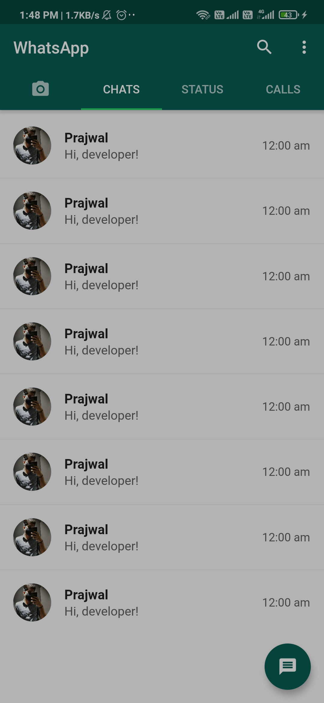
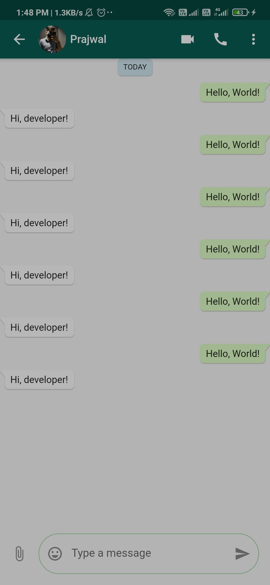
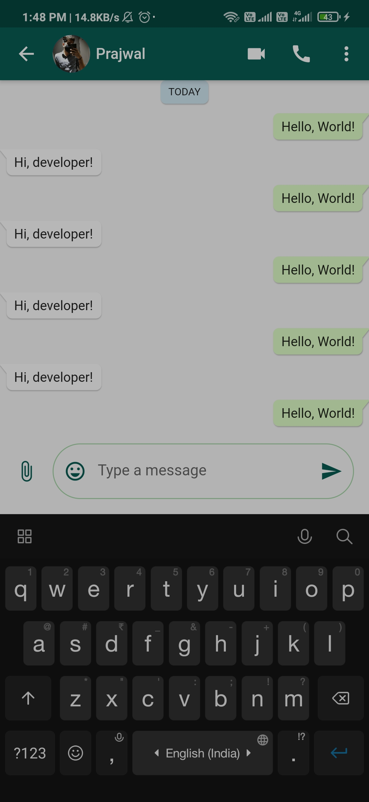
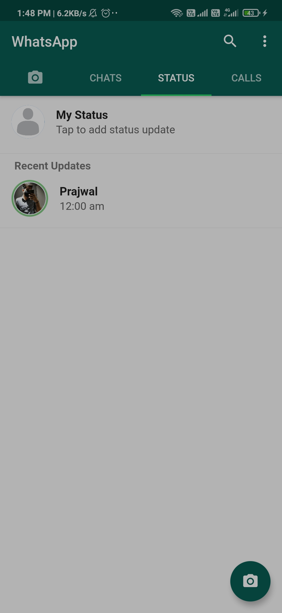
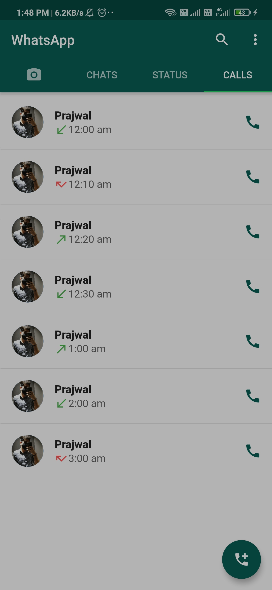
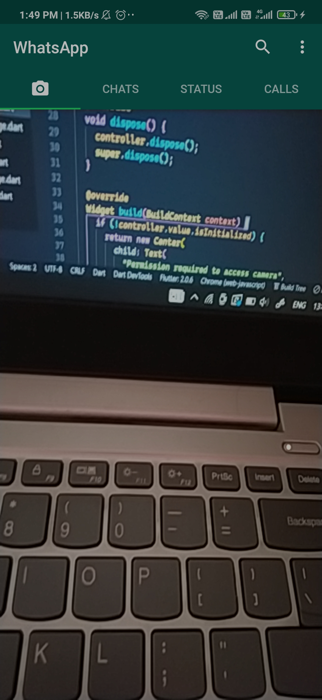

# whatsapp_ui

A new Flutter project.

## Application Screenshots.

  
  
  
  
  
  

## Getting Started

For help getting started with Flutter, view their
[online documentation](https://flutter.dev/docs), which offers tutorials,
samples, guidance on mobile development, and a full API reference.
